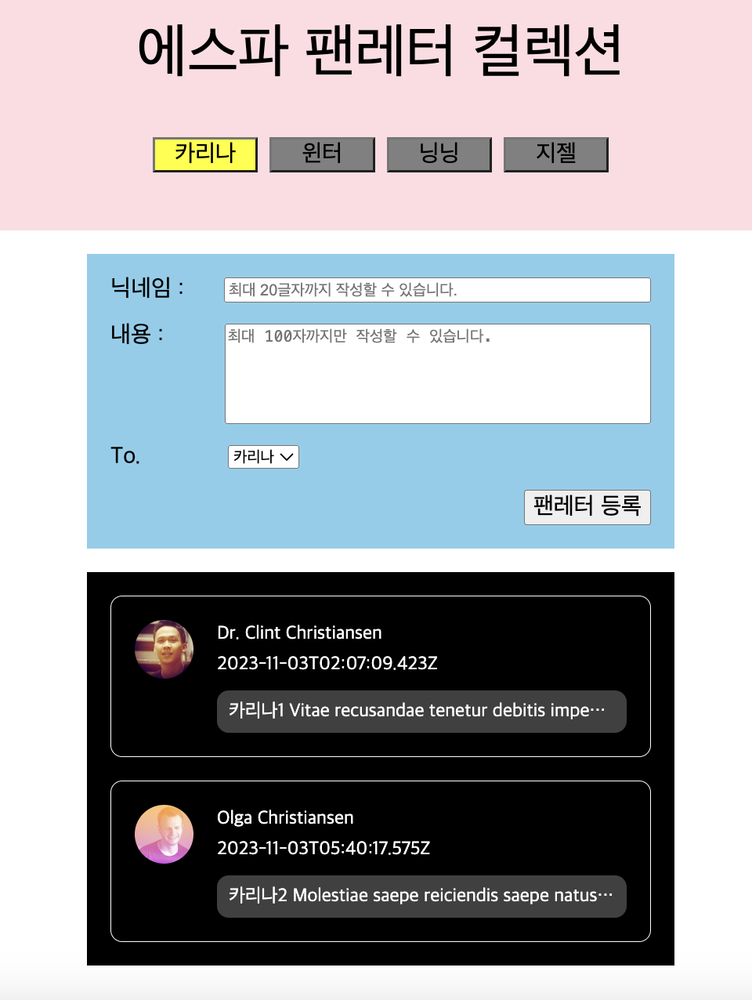
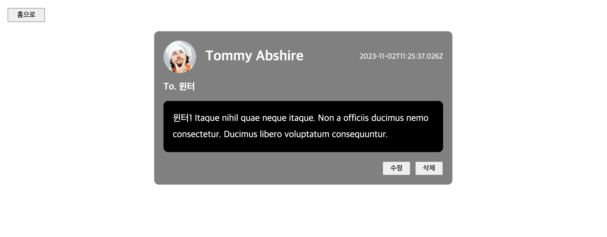

# Fanletters Mailbox (React)

- React\_그룹 아티스트 팬레터 사이트
- `context API`, `Redux` 전역 상태 관리
- `Router` 페이지 이동

 

## 🖥️ 프로젝트 소개

그룹 아티스트 중 멤버를 선택하여 팬레터를 보내는 사이트입니다.

 

## 🕰️ 개발 기간

- 24.01.29 - 24.02.04 (7일간)

 

### ⚙️ 개발 환경

- `React`, `HTML5`, `CSS3`
- `context API`, `Redux`
- `Router`
- **environment** : Visual Studio Code, git, github

 

## ✨ 프로젝트 화면 구성 및 기능

- 메인 페이지

  

 

- 상세 페이지

  

 

## 📌 주요 기능

### 필수 구현사항

1. 팬레터 CRUD 구현 (작성, 조회, 수정, 삭제)

2. Home 페이지

   - 아티스트별 게시물 조회 기능 구현 (Home - Read)

   - 원하는 아티스트에게 팬레터 등록 구현 (Home - Create)

3. Detail 페이지

   - 팬레터 상세 화면 구현 (Detail - Read)

   - 상세화면에서 팬레터 내용 수정 구현 (Detail - Update)

   - 상세화면에서 팬레터 삭제 구현 (Detail - Delete)

4. styled-components 를 이용하여 스타일링

   - 스타일링이 들어가는 경우 styled-components 화

   - styled-components에 props를 넘겨 조건부 스타일링 적용

5. 팬레터 등록 시 id는 uuid 라이브러리를 이용

6. props-drilling, context API, Redux 각 브랜치 분리

   - `props-drilling` branch : useState로 상태 관리

   - `context API` branch : context API 사용한 전역 상태관리로 리팩토링

   - `Redux` branch : redux 라이브러리 사용한 전역 상태관리로 리팩토링

 

## 📝 KPT 회고

### Keep (유지하고 싶은 좋았던 점)

- 지난 프로젝트 때 느꼈던 아쉬웠던 점을 개선하고자 노력한 것

  - 트러블 슈팅 과정, 새롭게 알게 된 지식들을 많이 기록함

- 해결되지 않는 부분은 팀원과 튜터님께 공유하여 빠르게 해결한 것

 

### Problem (아쉬웠던 점)

- context API 사용 시 구조분해할당으로 더 간결하게 작성하지 못한 점

- context API의 Provider를 다른 파일로 분리하지 못한 점

- Redux를 개념만 이해하고 내 코드에 적용하지 못한 점

 

### Try (Problem 해결 방법, 앞으로의 다짐 등)

- 구조분해할당 많이 연습하기

- 이번 과제의 전체적인 로직과 새롭게 배운 지식들 복기하기
